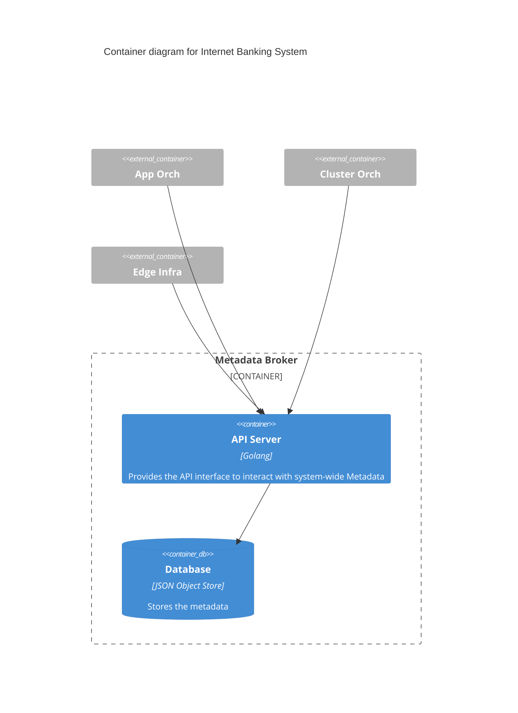
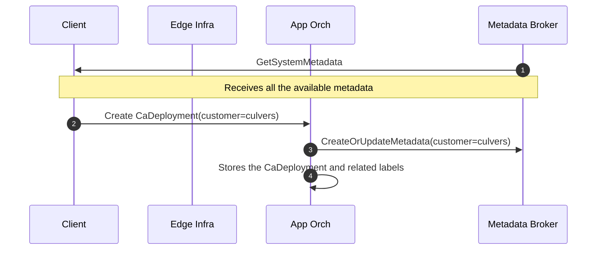
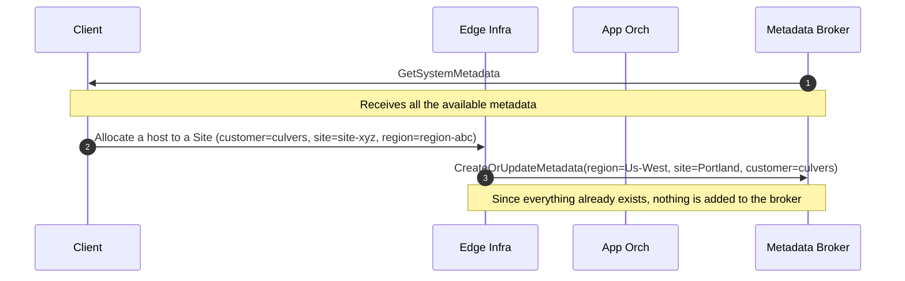
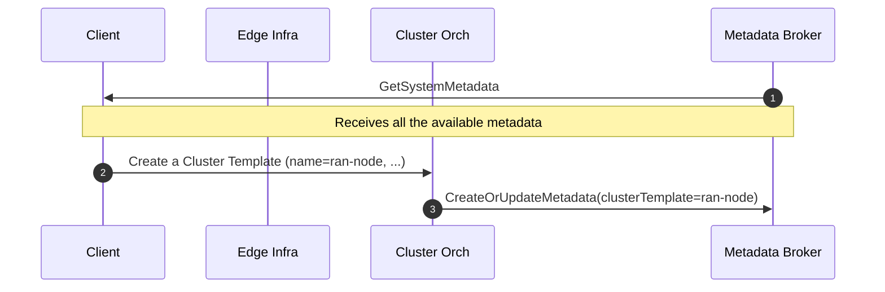
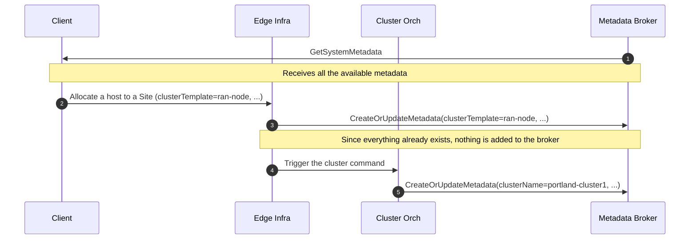
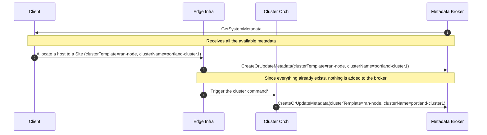
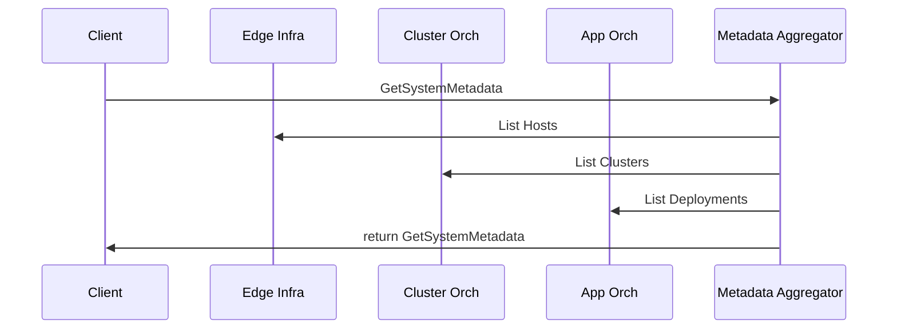

# Metadata Broker

We need two different kinds of data sharing:

1. The User Interface (whether graphical or API-based) needs to
   expose aggregate information to the user.
   - e.g., when looking at a Host, I want to know which Apps are running on it.
1. Each component needs to know what labels are available in the system.
   - e.g., when creating a CA Deployment, the user wants to know
     the existing labels.

At the same time, we have requirements to keep the three subsystems independent
so that they can be used in isolation (this is a future feature,
but we need to make sure we don't cross boundaries,
or it will be very hard to disentangle the components later on).

To address the above requirements, we've created the metadata-broker service
to store and retrieve metadata entered by the user across services,
enabling the orch-ui to populate the UI to recommend metadata keys or values
to the user based on previous entries.

The Metadata Broker must keep metadata as isolated as possible from
the client components. The Broker **should only store the metadata key names
and values that can be used in the system, not their association with objects
in the data model**. Storing such information should be up
to the client component. The Broker exposes a CRUD API interface that
can be used to control the data lifecycle. This should be made available
through an Administrative Dashboard and controlled via RBAC. For example,
if metadata with a typo is stored, the administrator can remove it
via the dashboard, and when the metadata is corrected in the subcomponent,
the new (and correct) value will be stored in the broker.
**It is important to note that metadata creation should be idempotent**;
creating the same metadata multiple times will not change
the state in the broker.

The Metadata Broker is isolated per project.
Users can only see metadata for the project they are in.

## High-Level Architecture

Each component will know how to reach the Broker to keep it up to date
with the existing metadata. The high-level call flow when
something is created/updated in a component is as follows:

1. The (pertinent*) metadata are sent to the Broker.
1. The object is saved in the component store, along with its own metadata.

_* There are cases in which not all the metadata stored with an object
need to be shared outside the sub-system boundaries. In that case,
it is perfectly fine for the component not to share them with the Broker._

## End-to-End Usage Examples

### Package Deployment

The following are some example flows involving the User/Operator and
the high-level components. This document does not drill down into how
the sub-systems would implement the calls to the broker as that’s
an internal detail. The following examples loosely follow the ZTP flow planned
for WG as demonstrated in Milestone and assume starting from an empty system.

> NOTE: In the following set of examples, `customer` is used as metadata,
> but it's a symbolic value that can be replaced with anything that has value
> for the operator. The same exact pattern applies if multiple metadata are used
> to identify elements.

#### Creation of a Package Deployment

1. The client fetches all the existing Metadata from the broker.
   - Nothing is returned since nothing associated with a label
     exists in the system yet.
1. The User creates a Deployment with a label of “customer=culvers”.
1. App Orch sends the metadata to the Broker.
1. Once the metadata are stored in the broker, App Orch stores the data
   internally and proceeds.
   - This can be seen as a "validation" step for metadata,
     which is a planned feature in the Broker.

#### Allocation of a Host to a Specific Site

_We assume that Region and a Site are already present in the system.
Host provisioning is not depicted as it is out of scope for this document._

1. The client fetches all the existing Metadata from the broker.
   - The “customer” metadata is returned by the broker
     along with all the existing values.
1. The User allocates the Host to the Site (see workflow in Demo1).
   - The “customer” label is proposed to the user, with a selection of
     the existing values.
   - New values can be added to the “customer” metadata.
   - Other custom metadata can be added to the Host.
1. Edge Infra internally converts the Host data to a set of metadata that
   it wants to store in the broker so that other components can benefit from it.
   - Note that the internal value of “site=site-xyz” is rendered
     to a human-readable metadata as “site=Portland”. At this point,
     if we go back to create a second deployment, we’ll be suggested
     three different labels that we can use: Region, Site, and Customer.

### Cluster Management

This workflow is used to demonstrate that the proposed implementation
of the Metadata Broker provides flexibility in support of other use cases.

#### Creation of a Cluster Template

When a Cluster Template is created in Cluster Orch
(how it is created is outside the scope of this document),
a clusterTemplate metadata is registered in the Broker.

#### Creation of a New k8s Cluster

> NOTE: The cluster creation is actually triggered from Node Agent
> to Cluster Agent. That detail has been omitted as it is not
> relevant for this diagram.

1. The client fetches all the existing Metadata from the broker.
   - The clusterTemplate=ran-node is reported.
1. The Host is allocated to a Site.
   - The clusterTemplate=ran-node label is suggested to the user
     and assigned to the Host.
1. The metadata are sent to the Broker.
1. The cluster creation is triggered (this happens via the agents on the Edge Node).
   - No clusterName label was set, so a name is autogenerated
     and a new cluster is created.
1. The clusterName label is stored in the broker.

#### Adding a Host (Node) to an Existing Cluster

This flow is extremely similar to the previous one, with the difference
that when at step 1 the client fetches all the available metadata,
the clusterName=portland-cluster1 is returned and suggested to the User.
When this is added to the Host, and thus reported to Cluster Orch,
the server is added to the already existing cluster.

## Future Features

It would be easy, and already valuable,
to implement a “blind” storage of metadata.
But there is room for future expansions to provide even more value:

- Provide RBAC to the metadata
  (e.g., only the Admins can create new labels in the system).
- Provide validation (e.g., if label testbed is added,
  cannot add label environment=production).
- Provide an administrative UI to pre-populate labels in the system
  (this could be embedded in the LP UI).
- Support for custom(er) defined hierarchies.

## Metadata Aggregator

The metadata aggregator would not store any data but act as an API gateway
so that when the client requests the existing metadata,
it will query each sub-system and return the aggregated data.

The above-provided examples would still be supported.
Following is a diagram adapting one single example to describe the call flow:

